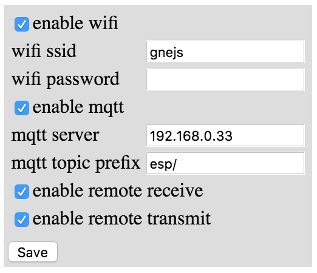
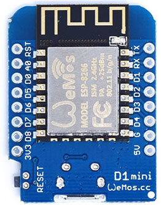
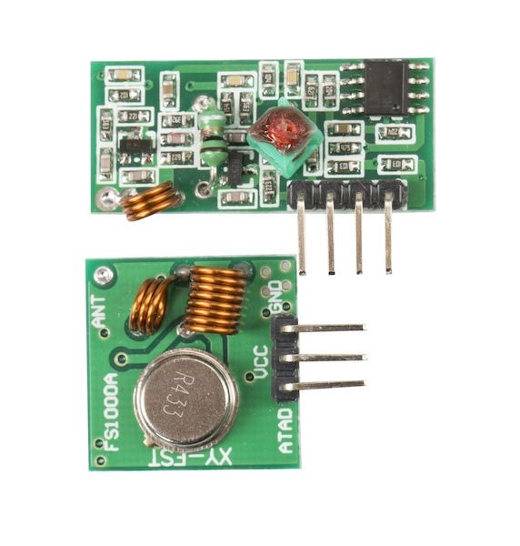

# Cheaperstick

A device consisting of a Wemos d1 mini, a 433MHz receiver and a transmitter.

It can be used to control cheap home control devices. Currently it supports some Prove brand devices, but will be extended to support other devices too.

## Features

- connects to a WiFi access point
- connects to an MQTT server
- sends an MQTT message on receiving a 433MHz code from a remote control
- on receiving an MQTT message it sends a 433MHz remote control code
- configuration is stored in EEPROM
- Web based admin page for
  - enabling/disabling WiFi, MQTT, remote receive, remote transmit
  - setting WiFi ssid and password
  - setting MQTT server ip
- acting as an AP if it can't connect to WiFi, to enable access to admin page

## Web admin page

## Building and running

Install PlatformIO and run it on command line or inside for example the Atom editor.

### Build from commandline

- git clone https://github.com/dagrende/cheaperstick.git
- cd cheaperstick
- connect Wemos d1 mini by usb cable
- pio run -t uploadfs
- pio run -t upload

### Build in the Atom editor

- git clone https://github.com/dagrende/cheaperstick.git
- start Atom that has PlatformIO installed
- open the cheaperstick folder
- connect Wemos d1 mini by usb cable
- click on the toolbar upload button

### Run

- reset you d1 mini and wait about 20s
- connect your pc to wifi ssid cheaperstick with password bettertoo
- open http://cheaperstick.local in a browser - you should see the web admin page above
- set ssid and password of your wifi
- set mqtt ip
- click save
- reset d1 mini
- connect your pc to the normal wifi
- open web admin page http://cheaperstick.local to see that cheaperstick is connected to the normal wifi

## Supported hardware

### Wemos d1 mini

See https://www.wemos.cc/product/d1-mini.html

### Receiver & transmitter

See http://www.ebay.com/itm/433Mhz-RF-transmitter-and-receiver-kit-for-Arduino-ARM-MCU-WL-/261041100836

## Planned Features

- USB serial interface as an alternative to WiFi for receiving and sending remote control codes
- REST interface as an alternative to MQTT
- Web based admin page for
  - enabling/disabling REST
  - setting mDNS name to be able to reach admin page by ip name instead of number
  - sniffing various types of remote controls
